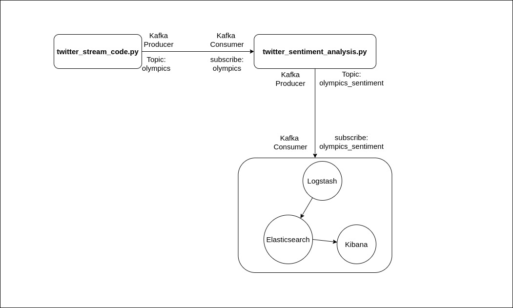
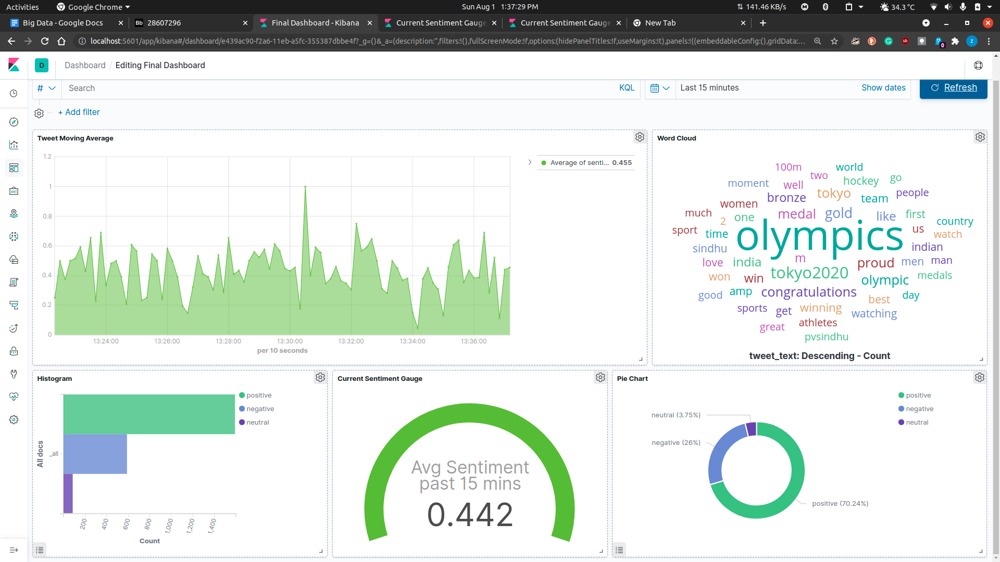
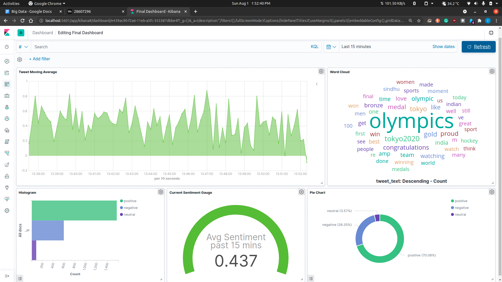
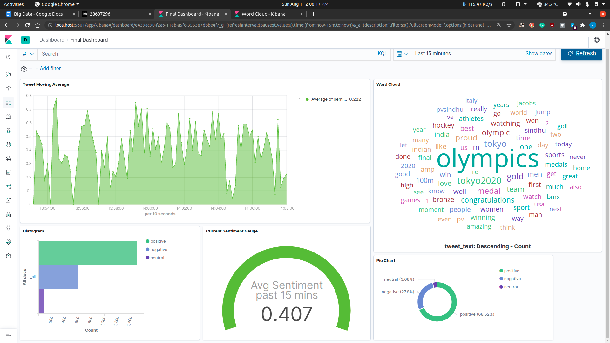

# Spark-Streaming-with-Twitter-and-Kafka
Spark Streaming with Twitter and Kafka + elastic search, logstash and kibana


Steps to run the code:
1. Install the Kafka server using this link http://selftuts.com/install-kafka-and-kafka-manger-using-docker-compose/

2. Running the kafka server containing Kafka, Zookeeper and Kafka-Manager
sudo docker-compose -f kafka-docker-compose.yml up

3. Installing and running the ElasticSearch and Kibana docker
Use this link http://selftuts.com/elasticsearch-and-kibana-installation-using-docker-compose/

4. Installing logstash
Use link given below and complete till the config file
http://selftuts.com/install-logstash-on-ubuntu-18-04/


5. Logstash config
sudo nano /etc/logstash/conf.d/kafka-elastic-pipeline.conf

Inside the editor paste the following:

```
input {
  kafka {
    bootstrap_servers => "0.0.0.0:9092"
    topics => ["olympics_sentiment"]
    codec => "json"
    decorate_events => true
  }
}
filter {
  mutate {
  convert => {"sentiment_value" => "integer"}
  copy => { "[@metadata][kafka][key]" => "tweet_text" }
  }
}
output {
  elasticsearch {
  hosts => ["0.0.0.0:9200"]
  index => "olympics_sentiment_analysis"
  workers => 1
  }
}

```


6. Restart Logstash to apply config file changes
sudo systemctl restart logstash


7. From the code folder run the twitter_sentiment_analysis.py file by using the following
command

spark-submit --packages org.apache.spark:spark-sql-kafka-0-10_2.12:3.1.1 --driver-memory
12G --jars <location of spark nlp jar> twitter_sentiment_analysis.py localhost:9092 subscribe
olympics

(download spark nlp jar) (https://s3.amazonaws.com/auxdata.johnsnowlabs.com/public/jars/spark-nlp-assembly-3.1.3.jar)


8. Wait for it to download the model and required files. Once the code starts listening for a topic
you can start streaming the data

Add twitter api credentials in twitter_credentials.py


Then run the spark-submit twitter_stream_code.py file using the following command
spark-submit twitter_stream_code.py


9. Goto the Kibana server in my case it is http://localhost:5601/
Then goto Management (settings icon on bottom left)
Click on Index patterns under the Kibana section then click create a new index.
Here you may be able to see the index name olympics_sentiment_analysis below
Enter the same term in the text input and click next. Then include timestamp and finish.
The index is created.


10. In dev tools run this PUT command so as to get field data as true which treats a word
instead of a full sentence. Useful for word cloud of the tweets

```
PUT olympics_sentiment_analysis/_mappings
{
  "properties": {
    "tweet_text": {
    "type": "text",
    "fielddata": true
    }
  }
}
```


11. Now you can create your own dashboard based on the streaming data from the sentiment
analyzer code.

To create your own dashboard you can click on visualize to create different charts and add them
to the dashboard.



Plots:







